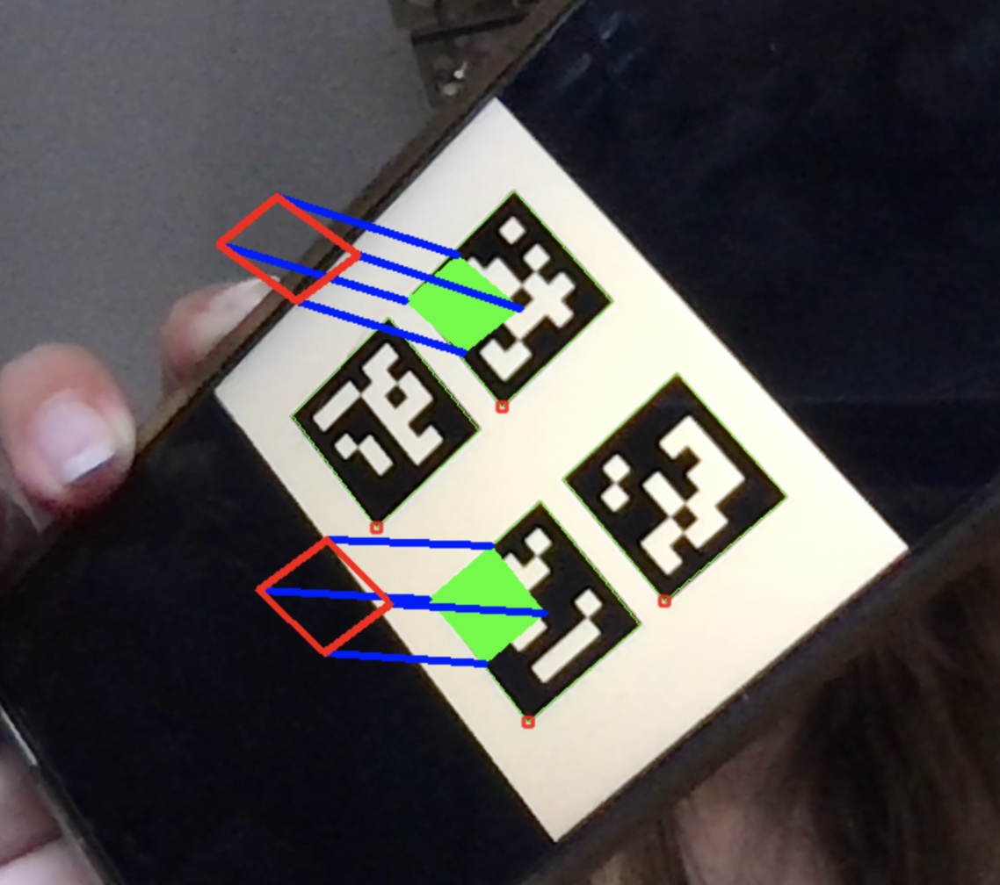
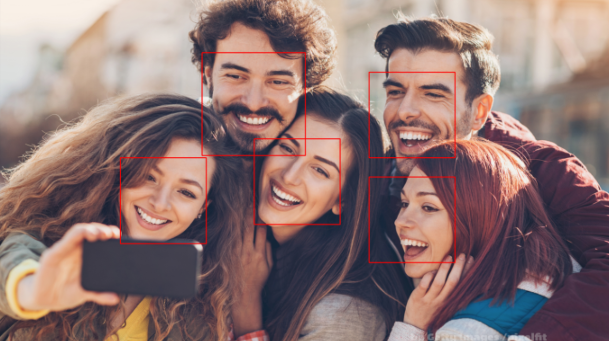
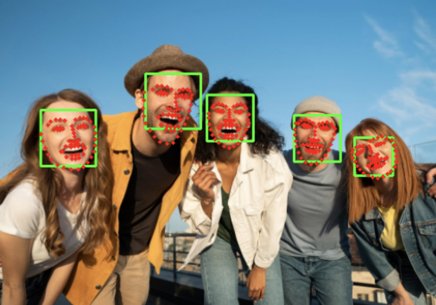

# Artificial Vision & Mixed Reality

> Practical computer vision projects developed during the MSc in Computer Engineering and Multimedia at ISEL.

This repository contains laboratory work and projects developed for the **Artificial Vision and Mixed Reality** course during the 2023–2024 academic year.

The work covers the full computer-vision pipeline, from camera calibration and image preprocessing to face detection, classical face recognition and object detection.

---

## Projects

### 1. Camera Calibration & ArUco / ChArUco

Camera calibration and fiducial-marker experiments using **OpenCV**, including:

* Camera calibration and parameter estimation
* ArUco marker and board detection
* ChArUco calibration
* Marker generation
* Calibration data analysis


>Registration of cubes in a 2x2 board of 6x6 250 ArUco markers with
ids 1 and 4.


---

### 2. Face Detection & Facial Landmarks

Comparison of different approaches for detecting and analysing faces, including:

* Haar Cascade classifiers
* OpenCV DNN-based detection
* Dlib
* MediaPipe
* Facial landmark detection
* Face normalization

The repository includes both image-based and real-time camera experiments.



> Face detection using HOG + Linear SVM 



> Dlib's 68 facial feature points

---

### 3. Eigenfaces & Fisherfaces

Classical face-recognition experiments using **PCA/Eigenfaces** and **LDA/Fisherfaces**, combined with KNN classification.

The objective was to explore how different linear representations of facial images affect recognition. Eigenfaces focus on principal directions of variation, while Fisherfaces aim to find projections that better discriminate between classes.

Implemented components include:

* Face image loading and preprocessing
* Face normalization
* Eigenfaces with KNN
* Fisherfaces with KNN
* Comparison of classical face-recognition approaches


---

## Technical Skills

* **Python**
* **OpenCV**
* **NumPy**
* **Dlib**
* **MediaPipe**
* **YOLOv4**
* PCA / Eigenfaces
* LDA / Fisherfaces
* KNN classification
* Camera calibration
* ArUco / ChArUco
* Facial landmarks
* Image preprocessing and normalization
* Real-time computer vision
* Jupyter notebooks

---

## What this project demonstrates

This coursework provided hands-on experience with both **classical and learning-based computer vision**, including the transition from image processing and geometric calibration to face recognition and object detection.

It also provided practical experience with the stages of a visual-processing pipeline:

```text
Camera / Image
      ↓
Preprocessing
      ↓
Detection
      ↓
Feature Extraction
      ↓
Classification / Recognition
      ↓
Visual Result
```

---

## Academic Context

**Course:** Artificial Vision and Mixed Reality
**Degree:** MSc in Computer Engineering and Multimedia
**Institution:** ISEL
**Academic year:** 2023–2024

This repository is a portfolio-oriented record of coursework and practical experiments developed during the Master's programme.

---

## Author

**Sofia Fernandes Condesso**

Data Scientist / ML Engineer

[GitHub](https://github.com/sofiafernandescd)

---

## License & Academic Attribution

This repository is primarily an academic record and portfolio of coursework.

Some materials originate from or build upon course-provided resources, external libraries, datasets, models or other third-party assets. Their respective authors and licenses remain applicable.

The original implementations and modifications authored by me may be reused for educational or research purposes, with appropriate attribution.
